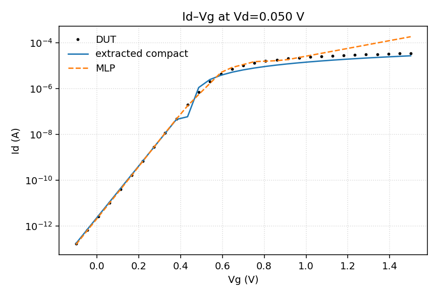
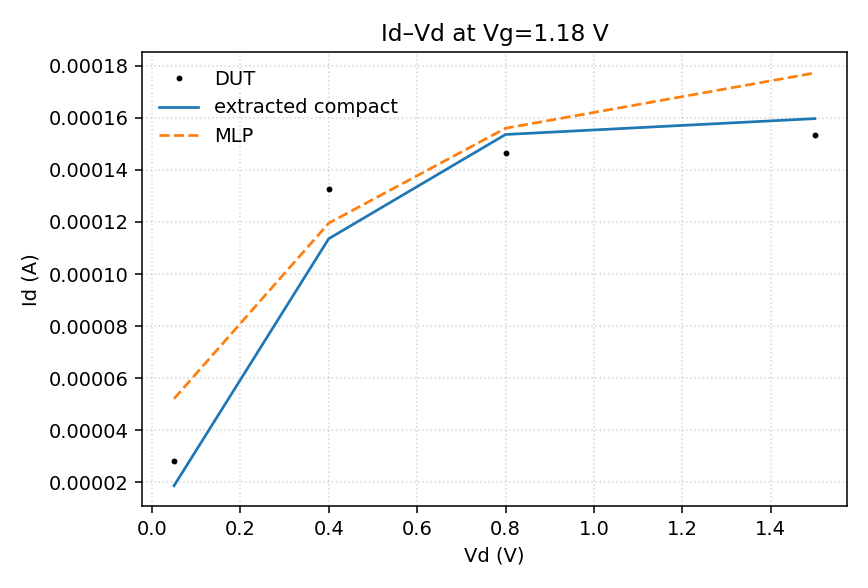
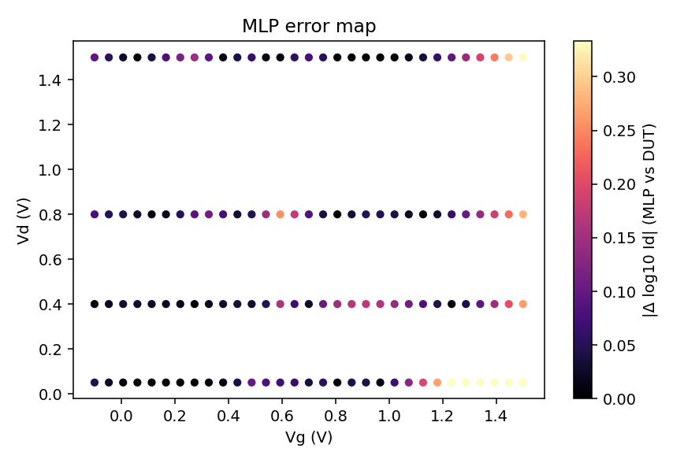

# device-ai-ivfit

End-to-end **MOSFET compact-model extraction + tiny MLP surrogate**.

Two DUTs, same extractor (the extractor never reads hidden parameters):

1. Default `make all` synthetic path: EKV-like teaching model (subthreshold + square-law) + 3% log-domain noise. **Not** wafer data.
2. `data/tcad_tutorial.csv`: I–V exported from the Synopsys Sentaurus **GettingStarted** example `sdevice/SOI_IdVg` (Lg = 0.2 µm SOI nMOS, body tied). **Not** a foundry PDK and **not** silicon-on-wafer measurement. Lab decks / `.plt` stay off git.

```
I–V family  →  extract Vth / SS / k / λ  →  compact card
            →  MLP on log10(Id) (train Vg≤1.2 V)
            →  hold out Vg>1.2 V (must get worse)
            →  Id–Vg / Id–Vd / error map
```

`make all` runs the synthetic gates first, then refits the Sentaurus tutorial CSV so the committed figures are the tutorial device.

## Figures







## Run

```bash
python3 -m venv .venv
. .venv/bin/activate
pip install -r requirements.txt
make all
```

Expect `FIT: PASS` twice (synthetic, then tutorial CSV). Meaning of the gates:

| Gate | Synthetic DUT | Sentaurus tutorial CSV |
|------|---------------|------------------------|
| `vth_err < 0.08` | √Id intercept vs hidden `TRUE.vth` | **not used** (no hidden truth) |
| `40 < SS < 200 mV/dec` | n/a | subthreshold slope sanity |
| `log_rmse_mlp_in < 0.45` | surrogate usable **inside** the train box | same |
| `log_rmse_mlp_extra > in` | the network is **not** a physical law | same |

`--check-physics --vth 1.2` must fail (device off).

## Resume lines (honest)

```
• Built an end-to-end MOSFET I–V compact-model flow: extract Vth/SS/k/λ from
  Id–Vg/Id–Vd families, emit a SPICE-like card, and train a tiny MLP surrogate.
• Fitted a Sentaurus GettingStarted SOI_IdVg tutorial device (not foundry PDK);
  also validated extraction to <80 mV Vth error on a noisy teaching DUT.
• Showed MLP error rising outside the train bias window (no physics extrapolation).
• Published scripts, figures, the tutorial I–V CSV, and the extracted card at
  github.com/lhysilicon/device-ai-ivfit (no PDK, no foundry models, no .plt).
```

Do **not** replace those lines with “fitted foundry silicon” or a BSIM/PDK claim.

## Files

| Path | What |
|------|------|
| `docs/method.md` | 15-minute talk |
| `src/physics.py` | synthetic DUT (hidden params) |
| `src/extract.py` | compact-model extraction |
| `src/model.py` | MLP on log10(Id) |
| `src/fit.py` | orchestration + gates |
| `models/nmos_extracted.inc` | extracted card |
| `data/synthetic.csv` | generated I–V (`vg,vd,id`) |
| `data/tcad_tutorial.csv` | Sentaurus tutorial I–V (`vg,vd,id` only) |

`python3 src/fit.py --csv data/tcad_tutorial.csv` uses the same three columns. Do not commit `.plt`, `.tdr`, or lab absolute paths.

## License

MIT
